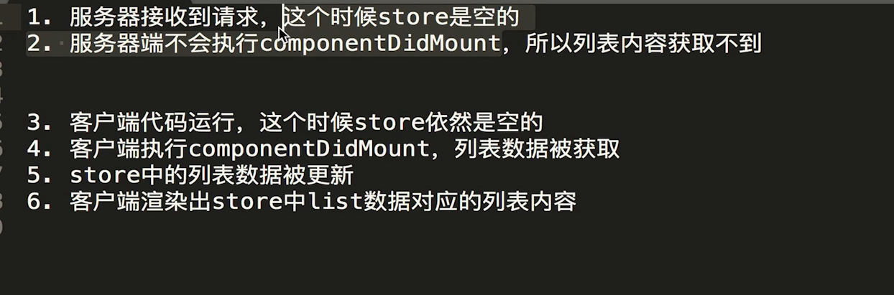
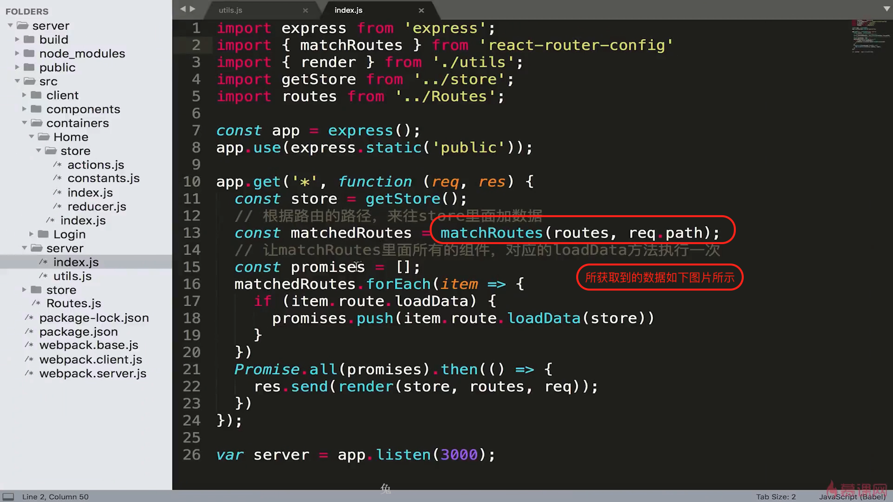
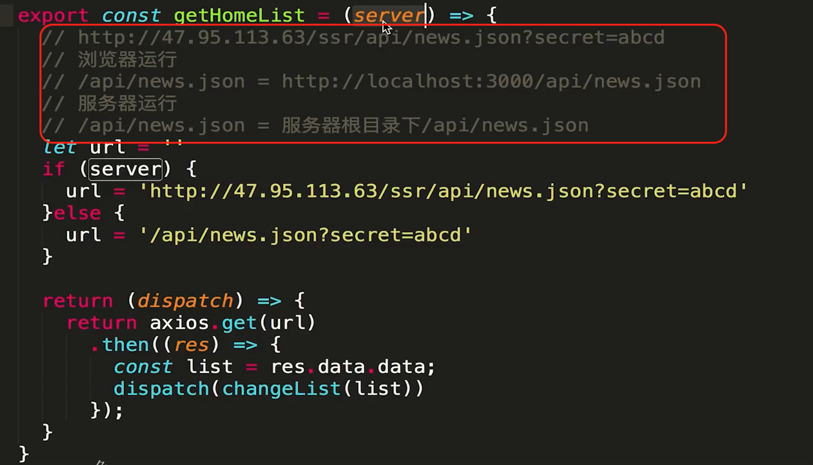

# react-ssr


单页面应用弊端：

TTFP 事件比较长（首屏时间比较长）。

并不具有seo排名的条件。百度等搜索引擎爬虫并不能从 js文件˙中获取数据。


## 2-1 ～ 2-2 在服务端编写react组件  服务端 webpack 的配置

webpack中target 属性的作用：（核心 表明打包后f的代码运行的宿主环境）

​			https://www.dazhuanlan.com/andychina/topics/1124872

 类似下面两行代码。

​     服务器端打包的代码中不需要 path这个模块。

​	浏览器端打包的代码中需要path这个模块（因为浏览器环境没有path这个内置模块）。


presets 配置项的作用（图片中基础的配置已经完成）


babel 中 plugin 和 presets 的作用
http://www.manongjc.com/detail/11-bbjbqsiycbzckcx.html


Webpack-node-externals   作用

当我们已经制定了target  == node 的话 我们引用 类似 path fs 这种node 内置核心模块后 并不会将这些代码打包到node_moudle中，当时我们引用express这种时候还是会被打包到 最终的bundles.js中。


## 2-3 ～2.4 实现服务端组件渲染，建立在虚拟dom上的服务端渲染

1. reactDom.render(jsx,dom). 将我们的react组件挂载到dom上

2. 在server 端需要将react组件使用renderToString 方法将组件转为字符串返回给客户端

    （redom.renderTostring 方法可以将虚拟dom转化为字符串返回给浏览器端）


### 虚拟dom的好处

*虚拟dom 是真实dom 的javascript 对象映射*

1.提升页面的渲染性能

2.使得服务端渲染更加容易。实际虚拟dom 也可以做native  同一套虚拟dom 在web端可以将虚拟dom转化为真实dom 通过render 挂载到id = root上面，在服务端可以通过rendertostring方法返回给客户端。native端可以将虚拟dom 转化为native端的元素展示在页面中

### 服务端渲染的弊端

对于服务器压力增大，原本浏览器进行的js运算放在了服务器端


 

https://stackoverflow.com 可以搜索一些报错问题


## 2.5webpack 的自动打包和服务器的自动重启

1. watch 参数 可以监听相关文件（入口文件，相关依赖文件）的变化。只要有文件变化就进行重新的编译 **服务器重启** 后改变的代码就生效。


2. nodemon  帮助node实现文件的监听，上面watch 参数只能重新编译出新的代码，但是这个代码需要服务器重新重启才能生效

​       nodemon 监听 “1” 也就是build文件夹下面的变化 一旦有变化就执行 “2”的这个指令

​	   superviser 也可以实现相同的效果

```js
'scripts':{
  "start":"nodemon --watch build. --exec node /'./build/bundles.js/'",
  "build":"webpack --config webpack.server.js --watch"
}
```

上面watch 参数 以及nodemon的使用使得

1.只要入口文件/相关依赖文件发生的变化 就重新进行打包编译----->导致build 文件下bundles.js文件发生变化（产物变化）----->这个build文件夹下面的变化被nodemon监听到 ----> nodemon执行了。node ./builde/bundles.js 指令（这个文件中包含着服务器代码），服务被重启

## 2-6  npm-run-all 提升开发效率

npm-run-all 这个包可以运行多个指令(上节课需要连续执行npm run build 然后执行。npm run start)


## 3-1什么是同构

一套react代码在服务器端执行一次，在客户端执行一次

https://www.jianshu.com/p/09037f948fab



我们给Home 组件de 元素上点击了 click 事件 但是不会生效 ，这是因为renderToString方法不会处理事件相关的东西，只会把组件ui相关的东西处理好返回给客户端。所以客户端需要再次运行下这个代码。

**同构:就是一套React代码在服务器上运行一遍，到达浏览器又运行一遍。服务端渲染完成页面结构，浏览器端渲染完成事件绑定。**

## 3-2 在浏览器上执行一段js 代码

1. express 静态资源管理

   app.use(express.static("pathname")) 只要请求的是静态资源，就会到pathname中进行查找


## 3.3 让react代码在浏览器上运行

1. 定义好需要在client执行的代码，这个代码也需要进行babel转译


2. 新增 webpack.client.js 对上面client的文件进行打包编译


3. 新增script中对于 客户端代码打包的指令


4. 返回给客户端的代码添加上需要在客户端运行的代码


## 3.4 工程代码优化整理

### Webpack-merge 用来合并webpack 配置文件  

1. webpack.base.js

   

2. webpack.server.js


3.webpack.client.js


### 将之前src 下面的index.js 嵌套到server目录下，这样目录结构清晰

​	不要忘记改对应webpack下面的入口


## 4.1 在SSR框架中引入路由机制

只有当js中的react代码接管页面操作之后才会有事件绑定


**传统pc端** react项目依赖于基础路由 broserRouter
**服务器端 ** react项目依赖于                staticRouter


同构的时候需要在服务端和客户端都跑一遍。

 


location：由于服务器端并不能主动感知客户端地址栏的变化，所以需要location 属性获取到当前的url地址

context： 服务器端用于数据传递给子组件


### hydrate：

https://www.zhihu.com/question/66068748


## 4-2 多页面路由跳转


## 4-3 	使用Link标签串联起整个路由流程


**服务端渲染只发生在我们第一次进入页面的时候（第一个页面，也并非是项目的主页），再次发生页面的跳转实际上bundles。js中的代码控制的，进行的还是react-router的路由机制**

## 4-4 中间层


## 5-1 在同构项目中引入redux

在客户端创建使用store


在server 端如何使用store 


在组件中使用store中的数据


## 5-2 创建 Store代码的复用


实际上面的代码是有问题的，会产生用户数据错乱问题，因为都是单例的store


此时可以保证用户可以有自己独立的store


##  5-3构建 redux 代码结构





## 5-4 问题

根据下图我们发现我们这种在didmount中请求数据的方式依然客户端渲染，因为didmount生命周期并不会在服务端执行




react-router中已经考虑好了上面的情况，为了做服务端渲染获取数据


为了让服务端渲染完整的带有数据的页面就需要在进入这个路由之前将当前页面中所需要的数据提前加载好并且更新store中的数据，这样客户端请求的代码中（刷新某个页面/首屏加载）store已经能够满足当前页面的数据要求，客户端不需要请求。


需要的知识点

1.matchRoutes 匹配当前路由所涉及的所有组件，并且调用其定义好的LoadData方法。（注意didmount中的请求数据依然在）

2.Promise.all().then(返回客户端需要的字符串)

3.favicon 也会请求数据需要我们配置一个favicon的文件放在public中


server 相关的代码配置如下




## 5-5 页面出现闪屏的原因以及如何解决

产生原因：

 	用户请求首屏（或者刷新一个页面）服务端的sore已经请求好了数据，但是客户端获取的store 依然是一个空的对象（看下图 getStore方法如果没有做过其他操作其在客户端就是一个初始状态），此时没有数据----》白屏----〉请求完数据后展示。 所以出现了闪屏的效果

解决方法：数据的脱水，注水

​	也就是服务端返回给客户端一个store的初始值。然后客户端将这个初始值给store。


### 数据的脱水注水


客户端脱水：（实际上就是客户端数据的初始化依赖于服务端’注水‘）


注意服务端渲染：渲染的是客户端请求的第一个页面（首屏/刷新其他页面）

**componentDidMount 生命周期对于数据的请求不能完全的抹除**（如用户首屏请求的是login页面然后跳转到list页面，此时list页面的数数据依然需要自己ajax请求。）所以折中判断下，如果服务端已经给我们请求好了数据（也就是初始状态：首屏/刷新当前页面），我们就不需要重复加载数据。


## 6-1让中间层承担数据获取职责


问题点：

我们需要我们搭建的node-server 承担起接口转发，初始页面渲染的指责（接口转发可以更好的定位问题）

但是之前的代码是这样：

如果是**服务端渲染**了这个页面，页面的数据是我们node服务器请求接口获取数据，更新store，渲染到页面上。最终返回给客户端。

如果是**客户端渲染**这个页面，（比如我们从登陆页面跳转到list页面，此时list页面的数据是我们前端发送ajax请求直接到javaserver端）最终完成store更新以及页面的渲染。

也就是 图片中的箭头，这是不合理的。


解决办法：
express-http-proxy  中间件，可以在express框架中添加一个proxy。


当**客户端**请求/api/* 的路径时候就会被这个proxy进行代理到其他路径！
但是他并不代理服务端发送的请求！！！导致在服务端渲染的情况下页面一直转圈，不能正确返回页面。


问题点：

在客户端运行的时候：我们最终访问的是 http://localhost:3000/api/news.json 这个访问被 express-http-proxy 截获最终访问http://47.95.133.63.........../news.json

在服务端运行的时候：我们访问的是服务器根目录下面的 api/news.json 这种不被截获！但是服务端没有这个路径/文件所以一直loading

解决办法：**6-2**

1. getHomeList  判断自己在客户端执行还是在服务端执行

2. 调用getHomeList 时候给他传递参数


## 6-2 服务端请求和客户端请求的不同处理

 


## 6-3 axios中instance的使用

本节是对上节代码的优化

6-2 的解决方法不适合全局使用，因为项目中有很多的接口请求，不能每个都这么配置

axios中有两个比较重要的概念：

​	1.instance

​	2.interceptors


## 6-4 巧用 redux-thunk 中的 withExtraArgument

本节是对上节代码的优化

上节的代码中我们依然需要传递参数的方式进行判断

反思：我们在服务端运行store的时候使用的是服务端的store实例。 

在客户端运行的时候使用的是客户端的store。

不同的store 使用不同的请求实例！！！Ï


## 6-4 使用 renderRoutes 方法实现对多级路由的支持

多级路由

renderRoutes 作用 渲染一级路由，并且把耳机路由的相关信息交给二级路由组件


## 6-4 登陆功能的制作

基本业务代码没内容

## 6-5 登陆状态切换

问题 node服务器  做proxy做接口转发的时候不会转发cookie等信息


## 6-6 解决登陆cookie 传递的问题

通过函数的方式生成axios 实例 然后获取到cookie 然后请求后端接口


## 7-1 secret密钥的统一管理


## 7-2  借助context 实现 404功能

更改200状态为404

componentDidmount 只有在客户端执行，不会在服务端渲染时候执行


## 7-3 实现服务器端301重定向功能

客户端的时候我们遇到 <Redirect  \/>组件的时候我们访问的话会直接进行重定向操作。

当时服务端渲染的时候只会返回包含 <Redirect /> 组件的字符串。但是并不会Ï执行重定向的操作。


如果我们访问地址对应的组件中render{ return( \<Redirect />. )} 组件的时候  staticRouter 会自动向staticContext所指向的数据容器中添加一些字段。如下：


## 7-4数据请求失败情况下Promise的处理


## 8-1如何支持css样式修饰


style-loader需要往window上面挂载一些东西，但是服务端渲染是没有window对象的

**解决办法：**

不能再base中添加 rules 也就是将客户端和服务器端的css 解析打包配置拆分开

客户端：style-loader

服务器端：isomorphic

客户端：


服务端：


**本节遗留问题：**isomorphic 虽然能够解决style-loader 在服务端不被支持的问题，但是其又会导致样式闪屏（页面结构先被加载进来，但是样式后被加载进来）而且样式是通过js加载进来的 禁用js后样式无法加载。

## 8-2如何实现css样式的服务器端渲染

上面的一节只是支持了css。而且最终的遗留问题也是因为样式并没有在服务端渲染好。

isomorphic-style-loader  发现页面引入了样式。div上面有class名字 ，他就会在渲染页面的时候把这个class名字加到最终返回的字符串中

style-loder：也会干同样的事情，**但是额外在html中添加了\<style>\</style>标签，里面包含了这些样式，所以页面能够有样式。**

所以我们在服务器端直接把这个样式放在 style标签中不就好了！


## 8-3 多组件中的样式如何整合

**上节课遗留的问题：**

1.注意staticContext 只传递给当前路由匹配的到的组件，并不会传递给这个组件包含的父组件。

2.每个组件中我们都更改了staticContext.css 的值，我们获取的最后的值肯定是最后一次更改的值，之前的值都被抹去了


**解决办法**

使用数组容器 每个组件push 进去自己的样式就好了


## 8-4loadData方法潜在问题修正

问题核心：高阶组件有可能丢失原组件的静态方法Ï

​		当我们通过路由访问页面时候（初始状态/刷新页面），会调用页面所涉及组件的LoadData方法加载好所需要的数据，

​		但是我们之前在文件导出组件的时候导出的是经过高阶组件生成的一个新的组件。这个新的组件上面可能没有这个loadData方法（虽然connect 方法对之前的组件进行了静态方法的拷贝）但是出于严谨，应该将LoadData 方法挂载到 高阶组件生成的组件上面


## 8-5 使用高阶组件精简代码

样式的逻辑很重复啊！直接使用高阶组件进行逻辑服用


具体代码：
最终在组件中 使用下这个方法就可以了


## 9-1什么是SEO 为什么服务器端渲染对seo更加友好

seo search engine optimazetion


基础版：

\<title> 

 二代代搜索引擎（基于全文索引的搜索引擎），不仅仅根据title判断网页的内容还会根据整个页面全文的内容进行判断 

但是我们搜索结果的标题 还是由title决定的

 \</title>：

\<meta name="description" content="我是一个重要的页面" > 

展示在搜索结果的介绍中

\</meta>

 

 


## 9-2 如何做好SEO

1.原创性

2.链接的地址 跳转后的页面和之前的页面相关性要强，搜索引擎认为这个连接的价值大，
外部链接指向这个网站越多，证明这个网站价值更大

3.多媒体的优化，比如图片的原创性，和高清。目前先进的搜索引擎比如google 也能识别这些多媒体。丰富度越高 排名会靠前

## 9-3 使用React-Helmet进行每个页面title和meta的独立定制

客户端：会自动将Helmet 组件内部的child   （title/meta）放在html中正确的位置


服务端：


## 预渲染


普通用户访问这个页面的话只是一个普通的客户端渲染的页面

但是搜索引擎爬虫访问这个项目的时候，经过预渲染已经是"有页面内容"的页面了

实际上预渲染就是访问一下页面，然后将页面所有的内容生成一个html 然后返回给蜘蛛爬虫

可以搜索下prerender 项目了解下


但是预渲染技术就需要我们识别下访问我们页面的是 爬虫还是用户

所以在项目架构的外层 添加一层Nginx服务器，由ngix服务器通过user-agent/ip等信息 来识别。

prerender 底层有个pentam.js
prerender原理，爬虫访问prender服务器，prerender服务器会生成一个小浏览器，再由这个小的浏览器去访问目标页面。识别网页中的内容，返回给爬虫，但是这个过程可能耗时。如果仅仅是出于Seo效果的话 prender的架构更好。

但是只是出于首屏时间的话还是ssr架构


