# react-ssr


单页面应用弊端：

TTFP 事件比较长（首屏时间比较长）。

并不具有seo排名的条件。百度等搜索引擎爬虫并不能从 js文件˙中获取数据。


## 2-1 ～ 2-2 在服务端编写react组件  服务端 webpack 的配置

webpack中target 属性的作用：（核心:表明打包后的代码运行的**宿主环境**）

​			https://www.dazhuanlan.com/andychina/topics/1124872

 类似下面两行代码。

​     	服务器端打包的代码中不需要 path这个模块。

​		浏览器端打包的代码中需要path这个模块（因为浏览器环境没有path这个内置模块）。

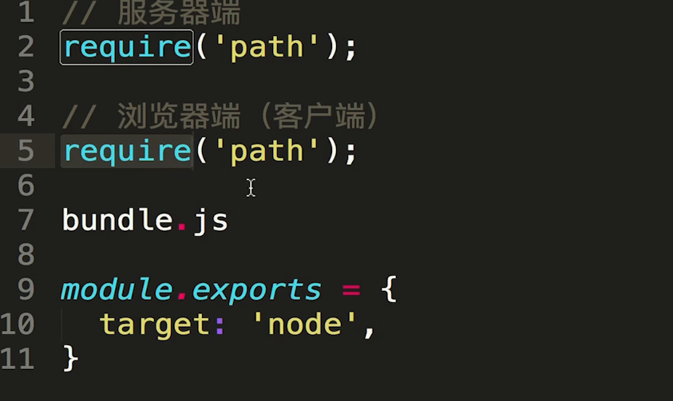

presets 配置项的作用（图片中基础的配置已经完成）


babel 中 plugin 和 presets 的作用
http://www.manongjc.com/detail/11-bbjbqsiycbzckcx.html

**babel 的作用：**

​	babel允许我们完全以ES6/ES7规范来写js代码，同时编译成es5地代码，以便最终可以在当前并未实现es6规范的浏览器上运行

**babel-preset 和 babel-plugin的关系：**

​	首先plugin 是针对单个 js feature进行处理的工具。由于feature特别多所以我们打包 将好多个 plugins 集成为一个 preset 这样可以方便对一个统一版本的js/一种框架的js 进行编译。使它可以在浏览器里运行


**推荐配置：**

```json
// .babelrc
{
  "presets": [
    "es2015",
    "react",
    "stage-3"
  ],
  "plugins": ["transform-class-properties"]
}


// package.json
{
  "babel": {      // nest config under "babel"
    "presets": [
      "es2015",
      "react",
      "stage-3"
    ],
    "plugins": ["transform-class-properties"]
  }
}

```

**externals配置项的作用：**

​	https://segmentfault.com/a/1190000012113011

​	**假设：**我们开发了一个自己的库，里面引用了lodash这个包，经过webpack打包的时候，发现如果把这个lodash包打入进去，打包文件就会非常大。那么我们就可以externals的方式引入。也就是说，自己的库本身不打包这个lodash，需要用户环境提供。


**webpack-node-externals 作用**

​	当我们已经制定了target  == node 的话 我们引用类似 path fs 这种node 内置核心模块后 并不会将这些代码打包到node_moudle中，但是我们引用express这种时候还是会被打包到 最终的bundles.js中。
​	我们使用webpack-node-externals 后webpack会完全忽略 node_modules 中的包 直接通过 externals 的方式进行引用
​	https://www.npmjs.com/package/webpack-node-externals

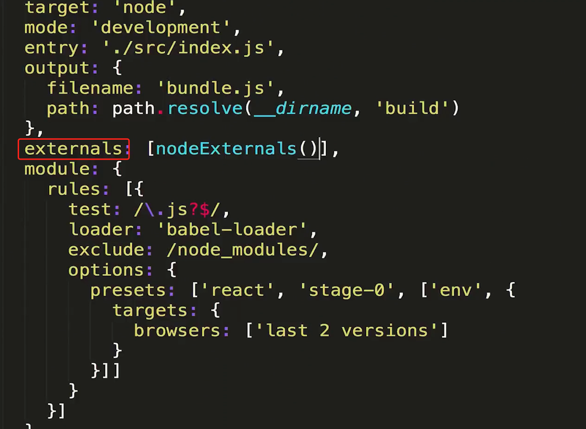


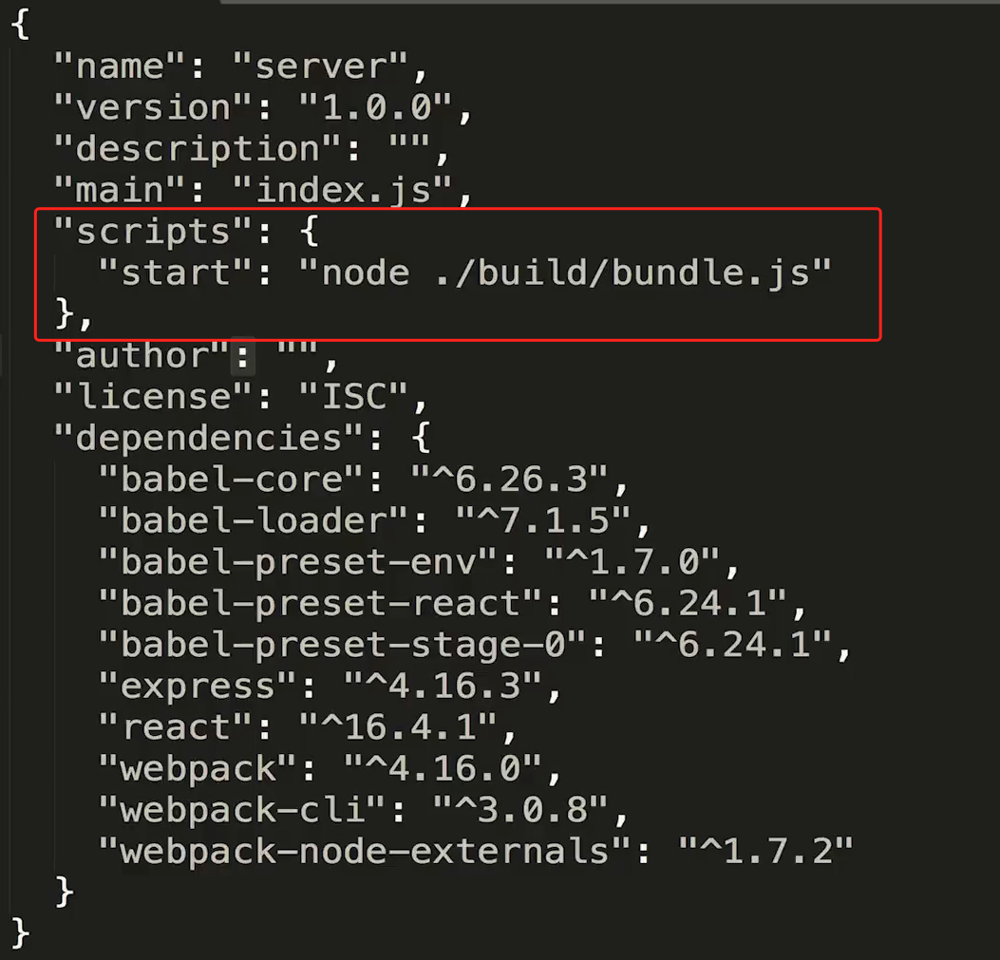

## 2-3 ～2.4 实现服务端组件渲染，建立在虚拟dom上的服务端渲染

1. reactDom.render(jsx,dom). 将我们的react组件挂载到dom上。

2. 在server 端需要将react组件使用renderToString 方法将组件转为字符串返回给客户端。

    （redom.renderTostring 方法可以将虚拟dom转化为字符串返回给浏览器端）


### 虚拟dom的好处

*虚拟dom 是真实dom的 javascript 对象映射*

1. 提升页面的渲染性能，抽象了渲染的过程，实现最小粒度的dom渲染，将之前浏览器对dom变动的比对改为  js引擎比对js对象，找出最小粒度的变动进行更新。

2. 使得服务端渲染更加容易。

3. 实际虚拟dom也可以做native  同一套虚拟dom 在web端可以将虚拟dom转化为真实dom 通过render 挂载到id = root上面，在服务端可以通过rendertostring方法返回给客户端。native端可以将虚拟dom 转化为native端的元素展示在页面中

### 服务端渲染的弊端

对于服务器压力增大，原本浏览器进行的js运算放在了服务器端

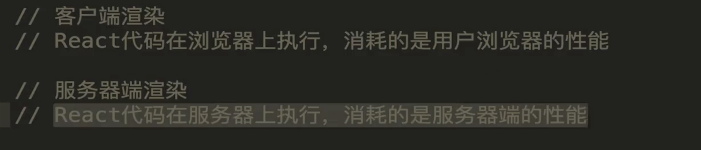

 

https://stackoverflow.com 
可以搜索一些报错问题


## 2.5webpack 的自动打包和服务器的自动重启

1. **watch 参数： ** 可以监听相关文件（入口文件，相关依赖文件）的变化。只要有文件变化就进行重新的编译 **服务器重启** 后改变的代码就生效。

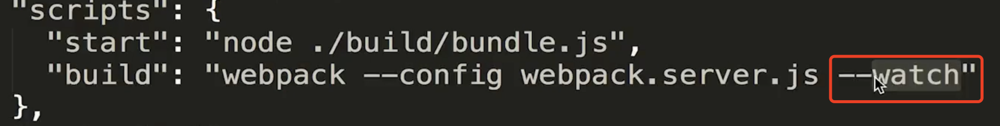

2. nodemon  帮助node实现文件的监听，上面watch 参数只能根据新的变动重新编译出新的代码，但是这个代码需要服务器重新重启才能生效/被我们访问。

​       nodemon 监听 “1” 也就是build文件夹下面的变化 一旦有变化就执行 “2”的这个指令

​	   superviser 也可以实现相同的效果

```js
'scripts':{
  "start":"nodemon --watch build. --exec node /'./build/bundles.js/'",
  "build":"webpack --config webpack.server.js --watch"
}
```

上面watch 参数 以及nodemon的使用使得

**===>**	入口文件/相关依赖文件发生的变化(我们写的业务代码发生比那话) 就重新进行打包编译。

**===>**	导致build 文件夹下bundles.js文件发生变化（产物变化）

**===>**	这个build文件夹下面的变化被nodemon监听到 

**===>**	 nodemon执行了  node ./builde/bundles.js 指令（这个文件中包含着服务器代码）

**===>**	服务被重启,我们刷新页面就可以访问到新的内容。

## 2-6  npm-run-all 提升开发效率

npm-run-all 这个包可以运行多个指令(上节课需要连续执行npm run build 然后执行。npm run start)


## 3-1什么是同构

**一套react代码在服务器端执行一次，在客户端执行一次**

https://www.jianshu.com/p/09037f948fab

> react服务端渲染建立在react虚拟DOM的基础上
>
> ​	renderToString这个方法，react里的事件不会被渲染出来，只能渲染出组件的基本内容。服务端先把页面渲染出后，让相同的代码在浏览器端像传统的react项	目一样再次运行一下
>
> 所以同构，说白了就是相同的代码，在浏览器端执行一次，在服务器上执行一次。




​	我们给Home 组件de 元素上绑定 click 事件 但是在浏览器中不会生效 ，这是因为renderToString方法不会处理事件相关的东西，只会把组件ui相关的东西处理好返回给客户端。所以客户端需要再次运行下react代码进行事件绑定。

**同构:就是一套React代码在服务器上运行一遍，到达浏览器又运行一遍。服务端渲染完成页面结构，浏览器端渲染完成事件绑定。**

## 3-2 在浏览器上执行一段js 代码

1. express 静态资源管理

   app.use(express.static("pathname")) 只要请求的是静态资源，就会到pathname中进行查找

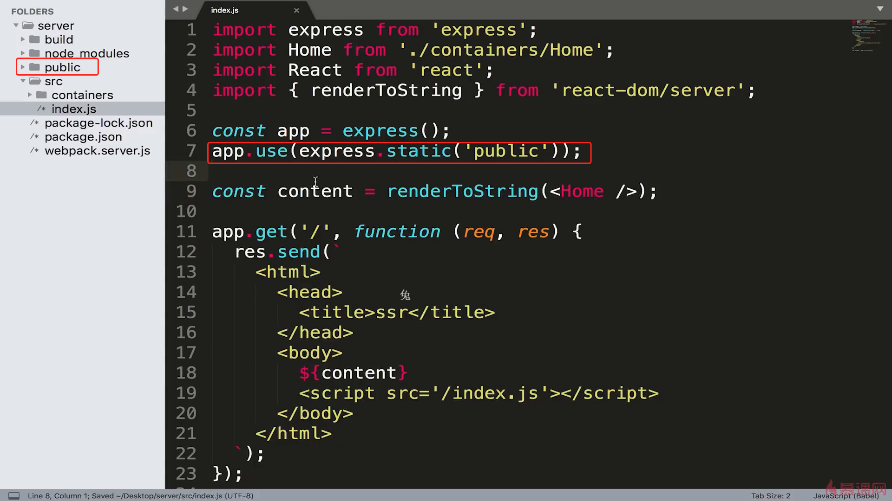


## 3.3 让react代码在浏览器上运行

1. 定义好需要在client执行的代码，这个代码也需要进行babel转译

2. ### hydrate：

   https://www.zhihu.com/question/66068748

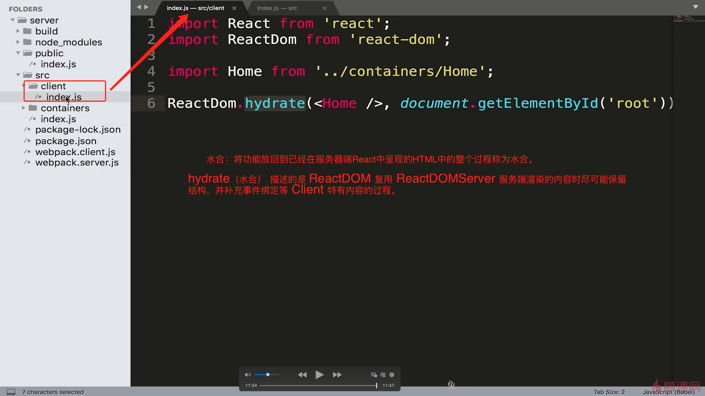

2. 新增 webpack.client.js 对上面client的文件进行打包编译


3. 新增script中对于 客户端代码打包的指令


4. 返回给客户端的代码添加上需要在客户端运行的代码


## 3.4 工程代码优化整理

### Webpack-merge 用来合并webpack 配置文件  

1. webpack.base.js

   

2. webpack.server.js

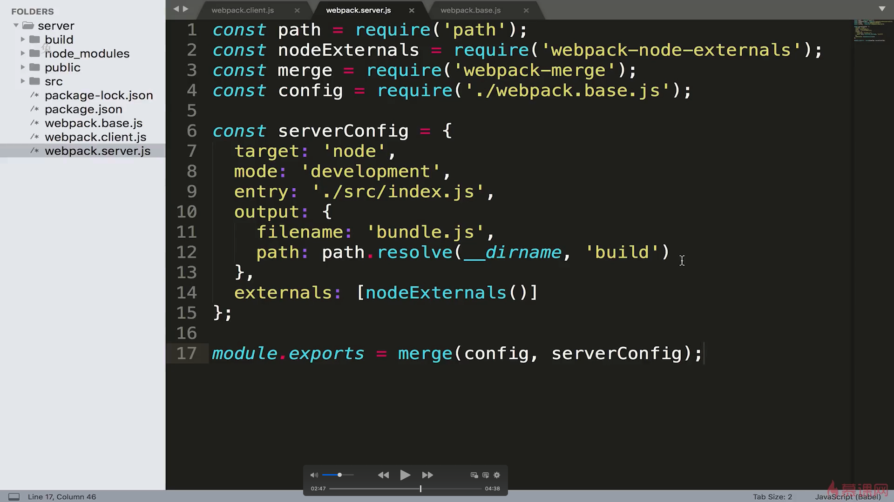

3.webpack.client.js


### 将之前src 下面的index.js 嵌套到server目录下，这样目录结构清晰

​	不要忘记改对应webpack下面的入口

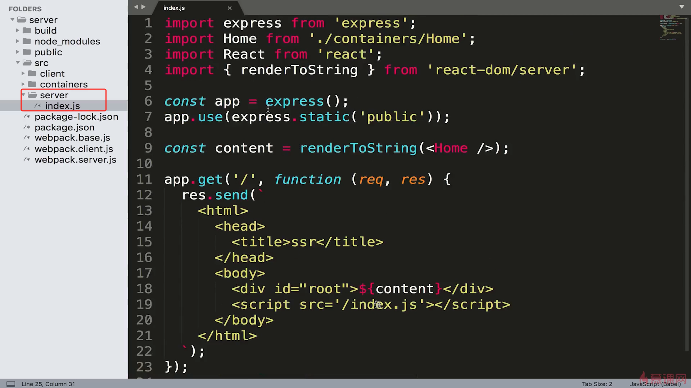


## 4.1 在SSR框架中引入路由机制

只有当js中的react代码接管页面操作之后才会有事件绑定


**传统pc端** react项目依赖于基础路由 broserRouter
**服务器端 ** react项目依赖于                staticRouter

**HashRouter和BrowserRouter的区别**

- **URL的表现形式不一样**
   BrowseRouter使用HTML5的history API，保证UI界面和URL同步。HashRouter使用URL的哈希部分来保持UI和URL的同步。哈希历史记录不支持location.key和location.state。
- **HashRouter不支持location.state和location.key**
   首先我们需要了解页面之间传值的方式，参考我之前写的文章
   [React页面传值的做法](https://www.jianshu.com/p/33ae1c9c992e)
   通过state的方式传值给下一个页面的时候，当到达新的页面，刷新或者后退之后再前进，BrowseRouter传递的值依然可以得到。


同构的时候需要在服务端和客户端都跑一遍。


**location：**由于服务器端并不能主动感知客户端地址栏的变化，所以需要location 属性获取到当前的url地址

**context：** 服务器端用于数据传递给子组件


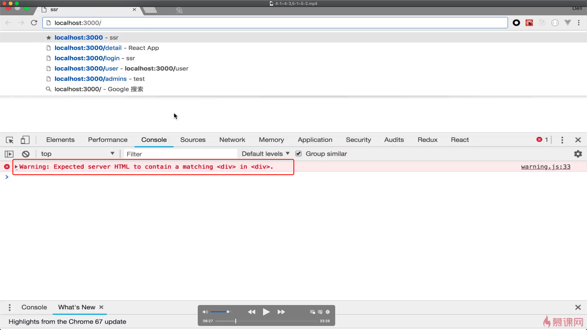


## 4-2 多页面路由跳转


## 4-3 	使用Link标签串联起整个路由流程


​	**服务端渲染只发生在我们第一次进入页面的时候（第一个页面，也并非是项目的主页），再次发生页面的跳转实际上bundles.js中的代码控制的，进行的还是react-router的路由机制**

## 4-4 中间层


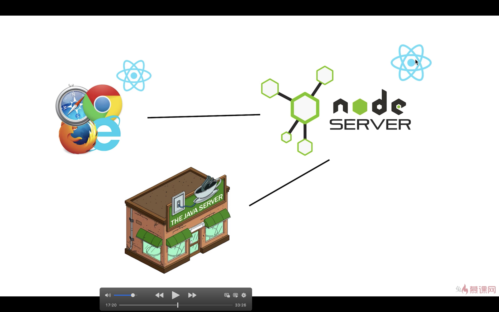

## 5-1 在同构项目中引入redux

在客户端创建使用store


在server 端如何使用store 

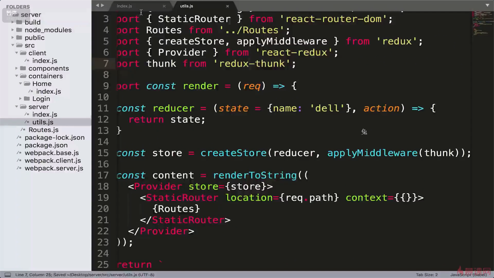


在组件中使用store中的数据


## 5-2 创建 Store代码的复用


实际上面的代码是有问题的，会产生用户数据错乱问题，因为都是单例的store


此时可以保证用户可以有自己独立的store

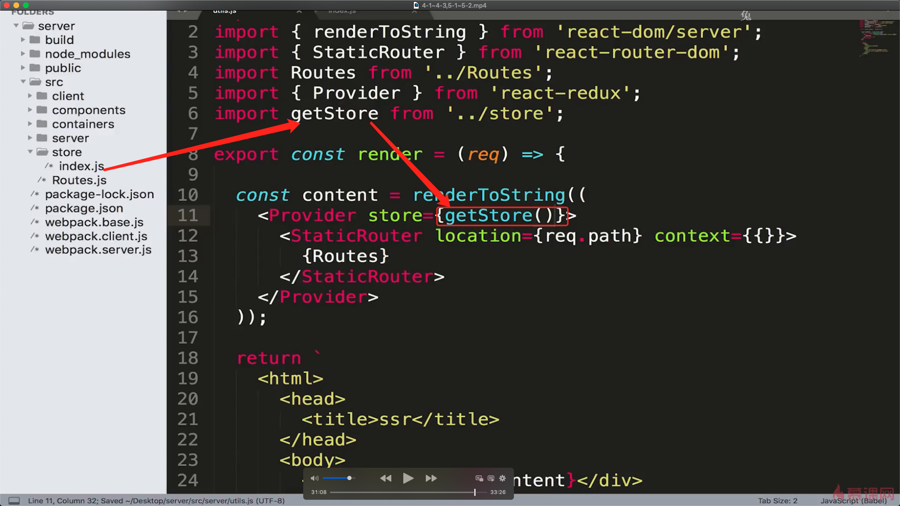

##  5-3构建 redux 代码结构


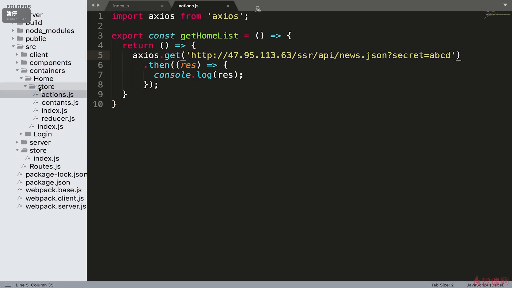





## 5-4 问题

根据下图我们发现我们这种在didmount中请求数据的方式依然客户端渲染，因为didmount生命周期并不会在服务端执行


react-router中已经考虑好了上面的情况：详见下面链接

https://reactrouter.com/web/guides/server-rendering


为了让服务端渲染完整的带有数据的页面就需要在进入这个路由之前将当前页面中所需要的数据提前加载好并且更新store中的数据，这样客户端请求的代码中（刷新某个页面/首屏加载）store已经能够满足当前页面的数据要求，客户端不需要请求。


需要的知识点

1.matchRoutes 匹配当前路由所涉及的所有组件，并且调用其定义好类的静态方法的LoadData。（注意didmount中的请求数据依然在）

2.Promise.all(请求所有组件所需要的必要数据).then(返回客户端需要的字符串)

3.favicon 也会请求数据需要我们配置一个favicon的文件放在public中


server 相关的代码配置如下


 **使用matchRoutes 可以获取到当前路由下 所有需要展示的组件，**

```javascript
[ { route:
     { path: '/',
       component:
        { '$$typeof': Symbol(react.memo),
          type:
           { [Function: ConnectFunction] displayName: 'Connect(Component)' },
          compare: null,
          WrappedComponent: [Function],
          displayName: 'Connect(Component)',
          getData: [Function] },
       getData: [Function],
       routes:
        [ { path: '/',
            exact: true,
            getData: [Function],
            component:
             { '$$typeof': Symbol(react.memo),
               type:
                { [Function: ConnectFunction] displayName: 'Connect(Component)' },
               compare: null,
               WrappedComponent: [Function],
               displayName: 'Connect(Component)',
               getData: [Function] } },
          { path: '/transition',
            getData: [Function],
            component:
             { '$$typeof': Symbol(react.memo),
               type:
                { [Function: ConnectFunction] displayName: 'Connect(Transition)' },
               compare: null,
               WrappedComponent: { [Function: Transition] getData: [Function] },
               displayName: 'Connect(Transition)',
               getData: [Function] } },
          { component: [Function: NotFound] } ] },
    match: { path: '/', url: '/', isExact: false, params: {} } },
  { route:
     { path: '/transition',
       getData: [Function],
       component:
        { '$$typeof': Symbol(react.memo),
          type:
           { [Function: ConnectFunction] displayName: 'Connect(Transition)' },
          compare: null,
          WrappedComponent: { [Function: Transition] getData: [Function] },
          displayName: 'Connect(Transition)',
          getData: [Function] } },
    match:
     { path: '/transition',
       url: '/transition',
       isExact: true,
       params: {} } } ]
```


## 5-5 页面出现闪屏的原因以及如何解决

产生原因：

 	用户请求首屏（或者刷新一个页面）服务端的sore已经请求好了数据，但是客户端获取的store 依然是一个空的对象（看下图 getStore方法如果没有做过其他操作其在客户端就是一个初始状态），此时没有数据----》白屏----〉请求完数据后展示。 所以出现了闪屏的效果

解决方法：数据的脱水〈===〉注水

​	也就是服务端返回给客户端一个store的初始值。然后客户端将这个初始值给store。


### 数据的脱水注水

​	https://zhuanlan.zhihu.com/p/323174003


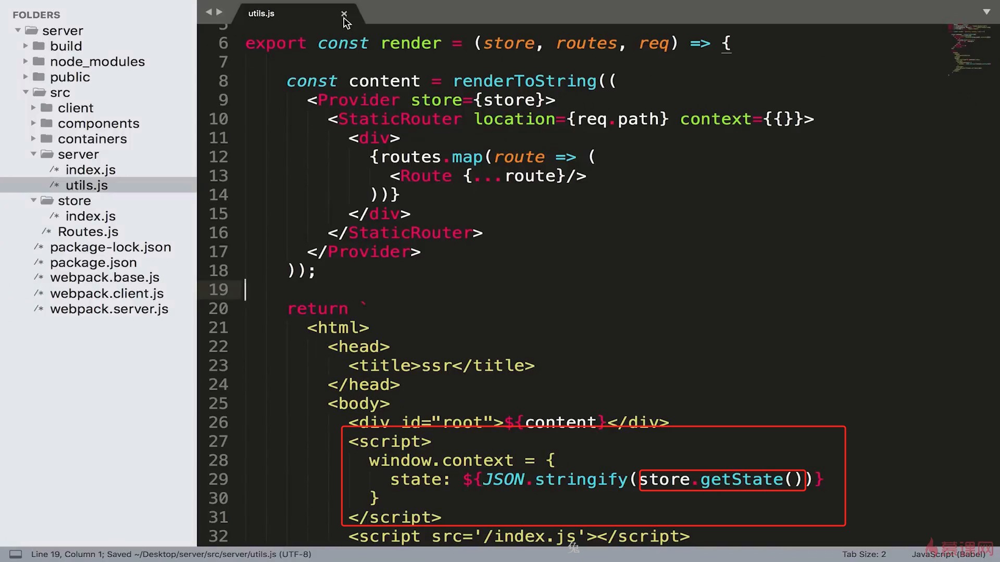


客户端注水：（实际上就是客户端数据的初始化依赖于服务端 脱水+ 将数据存储）

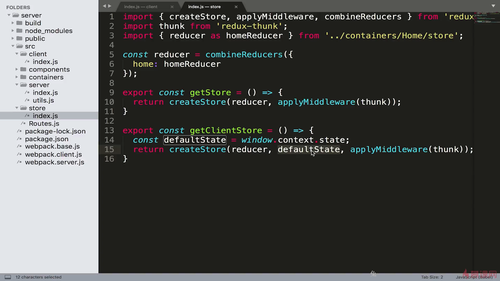


注意服务端渲染：渲染的是客户端请求的第一个页面（首屏/刷新其他页面）

**componentDidMount 生命周期对于数据的请求不能完全的抹除**（如用户首屏请求的是login页面然后跳转到list页面，此时list页面的数数据依然需要自己ajax请求。）所以折中判断下，如果服务端已经给我们请求好了数据（也就是初始状态：首屏/刷新当前页面），我们就不需要重复加载数据。


