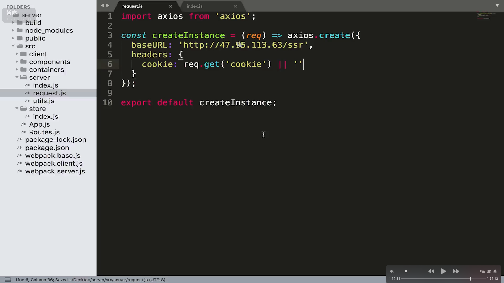
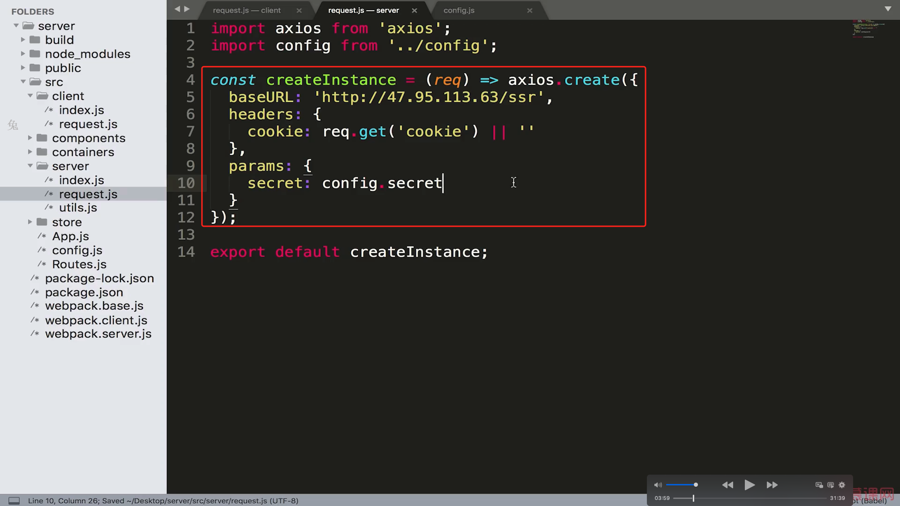
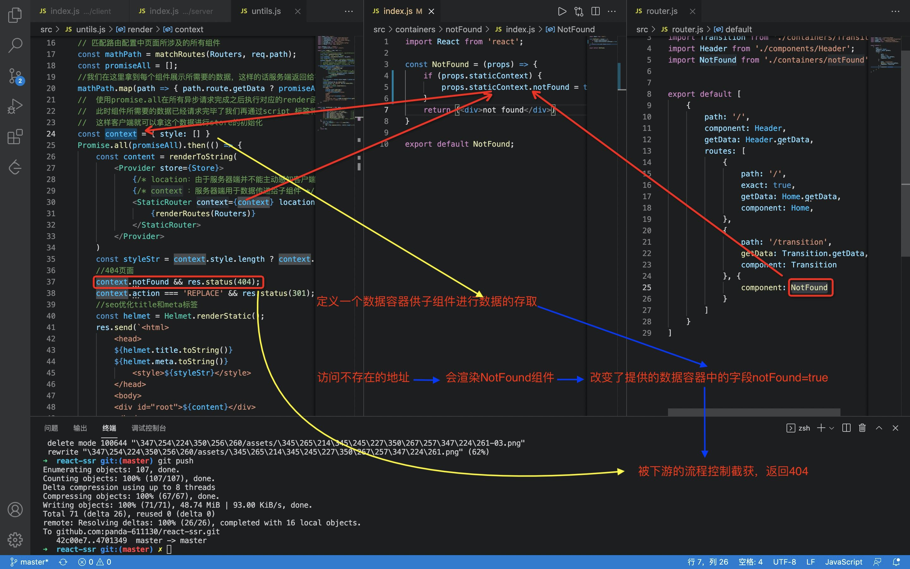
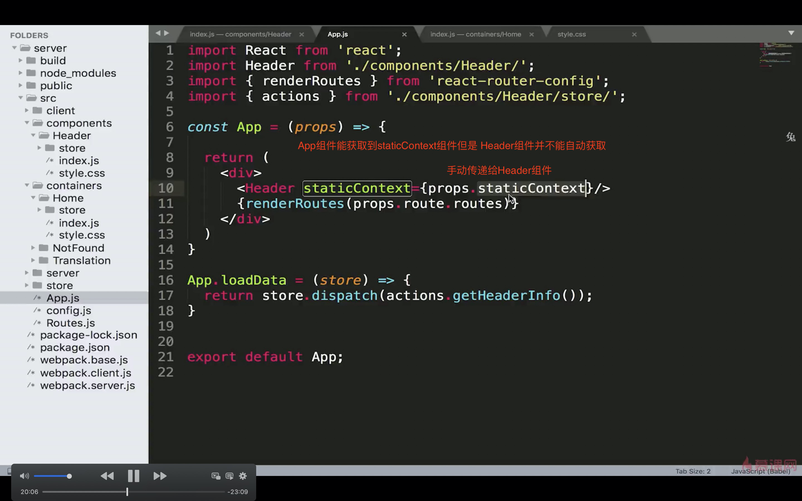

## 6-1让中间层承担数据获取职责

问题点：

​	我们需要我们搭建的node-server 承担起接口转发，初始页面渲染的职责（接口转发可以更好的定位问题）

但是之前的代码是这样：

​	如果是**服务端渲染**了这个页面，页面的数据是我们node服务器请求接口获取数据，更新store，渲染到页面上。最终返回给客户端。

​	如果是**客户端渲染**这个页面，（比如我们从登陆页面跳转到list页面，此时list页面的数据是我们前端发送ajax请求直接到java-server端，或者服务端请求数据的时 获取数据失败，客户端需要重新获取数据这种边界场景）最终完成store更新以及页面的渲染。

也就是 图片中的箭头，这是不合理的。

解决办法：将我们的 node-server 变成代理服务器。
**express-http-proxy**  中间件，可以在express框架中添加一个proxy。

当**客户端**请求/api/* 的路径时候就会被这个proxy进行代理到其他路径！
但是他并不代理服务端发送的请求！！！导致在服务端渲染的情况下页面一直转圈，不能正确返回页面。

问题点：

在客户端运行的时候：我们最终访问的是 http://localhost:3000/api/news.json 这个访问被 express-http-proxy 截获最终访问http://47.95.133.63.........../news.json

在服务端运行的时候：我们访问的是服务器根目录下面的 api/news.json (但是我们服务端下面是没有这个路径/接口) 这种不被截获！但是服务端没有这个路径/文件所以一直loading

解决办法：**6-2**

1. getHomeList  判断自己在客户端执行还是在服务端执行

2. 调用getHomeList 时候给他传递参数

## 6-2 服务端请求和客户端请求的不同处理

 

## 6-3 axios中instance的使用

本节是对上节代码的优化

6-2 的解决方法不适合全局使用，因为项目中有很多的接口请求，不能每个都这么配置

axios中有两个比较重要的概念：

​	1.instance

​	2.interceptors

## 6-4 巧用 redux-thunk 中的 withExtraArgument

本节是对上节代码的优化

上节的代码中我们依然需要传递参数的方式进行判断

反思：我们在服务端运行store的时候使用的是服务端的store实例。 

在客户端运行的时候使用的是客户端的store。

不同的store 使用不同的store实例！！！

那我们请求的实例也可以根据不同的宿主进行 定制化的生成。

这个是fetch版本实现的

## 6-4 使用 renderRoutes 方法实现对多级路由的支持

多级路由

renderRoutes 作用 渲染一级路由，并且把一级路由的相关信息交给二级路由组件

**renderRoutes**  做的事情很简单就是将当前url路由匹配的组件的子路由对应的组件的props中添加 route.routes 属性

## 6-4 登陆功能的制作

基本业务代码没内容

## 6-5 登陆状态切换

问题 node服务器  做proxy做接口转发的时候不会转发cookie等信息

## 6-6 解决登陆cookie 传递的问题

通过函数的方式生成axios 实例 然后获取到cookie 然后请求后端接口

## 7-1 secret密钥的统一管理

## 7-2  借助context 实现 404功能

更改200状态为404

componentDidmount 只有在客户端执行，不会在服务端渲染时候执行

## 7-3 实现服务器端301重定向功能

客户端的时候我们遇到 <Redirect  \/>组件的时候我们访问的话会直接进行重定向操作。

当时服务端渲染的时候只会返回包含 <Redirect /> 组件的字符串。但是并不会执行重定向的操作。

如果我们访问地址对应的组件中render{ return( \<Redirect />. )} 组件的时候  **staticRouter 会自动向staticContext所指向的数据容器中添加一些字段**。如下：

## 7-4数据请求失败情况下Promise的处理

## 8-1如何支持css样式修饰

style-loader需要往window上面挂载一些东西，但是服务端渲染是没有window对象的

**解决办法：**

不能再base中添加 rules 也就是将客户端和服务器端的css 解析打包配置拆分开

客户端：style-loader

服务器端：isomorphic

客户端：

服务端：

**本节遗留问题：**isomorphic 虽然能够解决style-loader 在服务端不被支持的问题，但是其又会导致样式闪屏（页面结构先被加载进来，但是样式后被加载进来）而且样式是通过js加载进来的 禁用js后样式无法加载。

## 8-2如何实现css样式的服务器端渲染

上面的一节只是支持了css。而且最终的遗留问题也是因为样式并没有在服务端渲染好。

**isomorphic-style-loader**  发现页面引入了样式。div上面有class名字 ，他就会在渲染页面的时候把这个class名字加到最终返回的字符串中

style-loder：也会干同样的事情，**但是额外在html中添加了\标签，里面包含了这些样式，所以页面能够有样式。**

所以我们在服务器端直接把这个样式放在 style标签中不就好了！

## 8-3 多组件中的样式如何整合

**上节课遗留的问题：**

1.注意staticContext 只传递给当前路由匹配的到的组件(header 组件中获取不到这个容器)，并不会传递给这个组件包含的父组件。

2.每个组件中我们都更改了staticContext.css 的值，我们获取的最后的值肯定是最后一次更改的值，之前的值都被抹去了

**解决办法**

1.

使用数组容器 每个组件push 进去自己的样式就好了

## 8-4loadData方法潜在问题修正

问题核心：高阶组件有可能丢失原组件的静态方法Ï

​		当我们通过路由访问页面时候（初始状态/刷新页面），会调用页面所涉及组件的LoadData方法加载好所需要的数据，

​		但是我们之前在文件导出组件的时候导出的是经过高阶组件生成的一个新的组件。这个新的组件上面可能没有这个loadData方法（虽然connect 方法对之前的组件进行了静态方法的拷贝）但是出于严谨，应该将LoadData 方法挂载到 高阶组件生成的组件上面

## 8-5 使用高阶组件精简代码

样式的逻辑很重复啊！直接使用高阶组件进行逻辑服用

具体代码：
最终在组件中 使用下这个方法就可以了

## 9-1什么是SEO 为什么服务器端渲染对seo更加友好

seo search engine optimazetion

基础版：

\<title> 

 二代代搜索引擎（基于全文索引的搜索引擎），不仅仅根据title判断网页的内容还会根据整个页面全文的内容进行判断 

但是我们搜索结果的标题 还是由title决定的

 \</title>：

\<meta name="description" content="我是一个重要的页面" > 

展示在搜索结果的介绍中

\</meta>

 

 

## 9-2 如何做好SEO

1.原创性

2.链接的地址 跳转后的页面和之前的页面相关性要强，搜索引擎认为这个连接的价值大，
外部链接指向这个网站越多，证明这个网站价值更大

3.多媒体的优化，比如图片的原创性，和高清。目前先进的搜索引擎比如google 也能识别这些多媒体。丰富度越高 排名会靠前

## 9-3 使用React-Helmet进行每个页面title和meta的独立定制

客户端：会自动将Helmet 组件内部的child   （title/meta）放在html中正确的位置

服务端：

## 预渲染

普通用户访问这个页面的话只是一个普通的客户端渲染的页面

但是搜索引擎爬虫访问这个项目的时候，经过预渲染已经是"有页面内容"的页面了

实际上预渲染就是访问一下页面，然后将页面所有的内容生成一个html 然后返回给蜘蛛爬虫

可以搜索下prerender 项目了解下

但是预渲染技术就需要我们识别下访问我们页面的是 爬虫还是用户

所以在项目架构的外层 添加一层Nginx服务器，由ngix服务器通过user-agent/ip等信息 来识别。

prerender 底层有个pentam.js
prerender原理，爬虫访问prender服务器，prerender服务器会生成一个小浏览器，再由这个小的浏览器去访问目标页面。识别网页中的内容，返回给爬虫，但是这个过程可能耗时。如果仅仅是出于Seo效果的话 prender的架构更好。

但是只是出于首屏时间的话还是ssr架构

